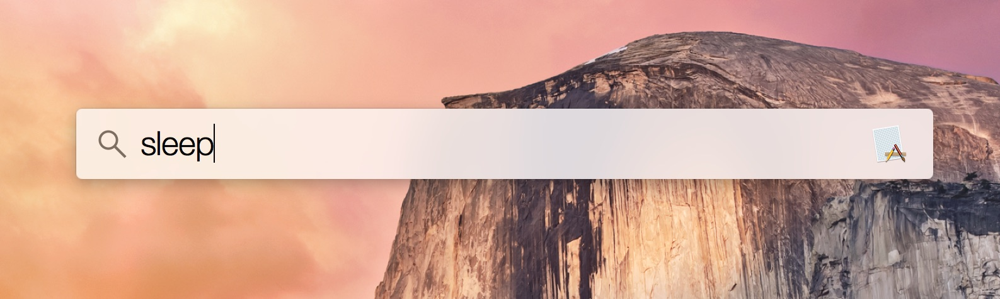

Sleep
=========

A Swift app to put your computer to sleep directly from Spotlight. Just build the app and install it in your applications folder.

### Download

You can download a signed version from [here](http://nscoding.co.uk/downloads/SleepOSX100.zip)

### Contact

[Patrick Chamelo](https://github.com/nscoding) 
[@nscoding](https://twitter.com/nscoding)

### Icon

[Kylan McBride](https://github.com/kmcbride)

### License

Sleep is available under the MIT license. See the LICENSE file for details.

Enjoy!

Patrick Chamelo.
 